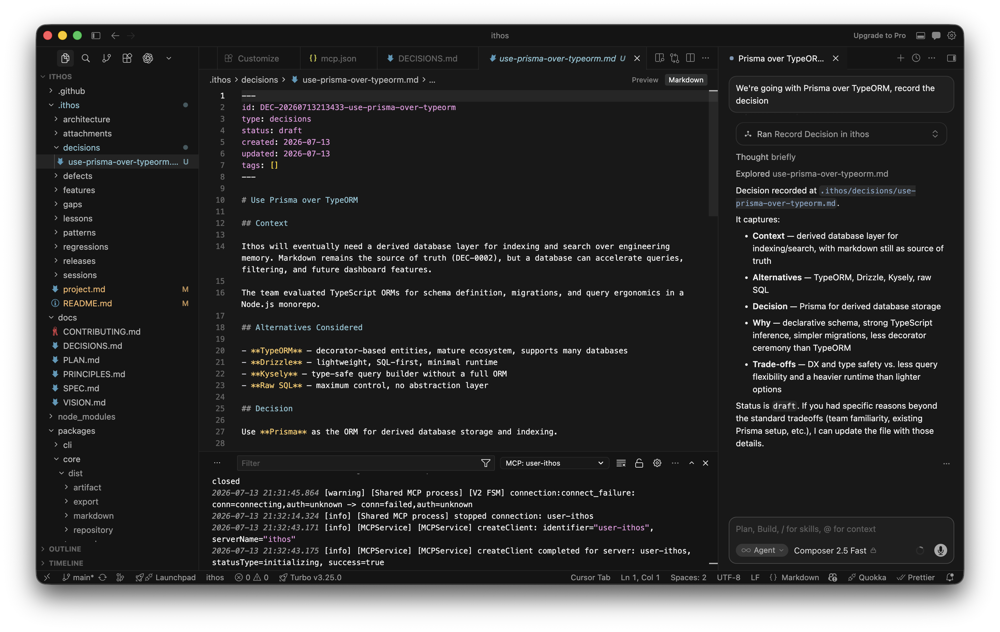

# Ithos

> The open, local-first institutional memory layer for AI-assisted software development. **Your data is yours. Saved in your own project's `.ithos` folder.**

A new developer (or engineering manager) joins the project and asks: *"Why did we choose Prisma over TypeORM?"*

How do they find out?
1. They search Slack/Discord (and find scattered threads).
2. They dig through old pull requests.
3. They ask a senior engineer to explain it again.
4. They ask an AI assistant, which hallucinates an answer because it lacks context.

Ithos solves this. It preserves **institutional memory**—the reasoning, trade-offs, lessons, and decisions—that explain *why* source code became what it is. While Git records *what* was built, Ithos records *why* it was built, making engineering knowledge durable for both developers and AI assistants.



---

## Why Ithos?

AI assistants can generate code faster than humans can review it. As code bases evolve rapidly:

- Reasoning gets lost inside ephemeral AI chat interfaces.
- Future maintainers struggle to understand why an architecture was chosen, why an approach was rejected, or what lesson was learned from a major regression.
- Project understanding decays over time.

Ithos establishes a standardized, git-native, markdown-based memory layout at the root of your project: `.ithos/`. It shifts the burden of documentation to the AI—as you code, your AI assistant automatically records the "why" into Ithos without breaking your flow.

---

## Repository Structure

```
.ithos/
├── README.md           # Introduction to Ithos for new AI agents & developers
├── project.md          # Project context summary, technology stack, conventions
├── decisions/          # Significant engineering decisions (one file per decision)
├── lessons/            # Post-mortems, bug resolutions, and workflow lessons
└── sessions/           # Developer session outcomes and accomplishments
```

All data is stored in **frontmatter-enhanced Markdown**, making it:

- 🌲 **Git-Native:** Participates in branches, commits, merges, and reviews.
- 📖 **Human-Readable:** Remains fully readable inside VS Code, Cursor, Obsidian, GitHub, or terminal without any proprietary tooling.
- 🤖 **AI-Friendly:** Structured schemas facilitate automated contextual reads and writes.

---

## Quick Start

### 1. Initialize your repository

Install the CLI globally and initialize Ithos in your project:

```bash
npm install -g ithos
ithos init
```

This creates the `.ithos/` folder structure in your current repository.

### 2. Connect your AI assistant via MCP

Install the MCP server globally:

```bash
npm install -g ithos-mcp
```

Then add it to your MCP client config.

**Cursor** (`~/.cursor/mcp.json`) or **Claude Desktop** (`~/Library/Application Support/Claude/claude_desktop_config.json`):

```json
{
  "mcpServers": {
    "ithos": {
      "command": "ithos-mcp"
    }
  }
}
```

> **nvm users:** The bare `ithos-mcp` command may not work since Cursor doesn't load your shell's PATH. Run `which ithos-mcp` in your terminal and use the full path instead:
> ```json
> {
>   "mcpServers": {
>     "ithos": {
>       "command": "/your/full/path/to/ithos-mcp"
>     }
>   }
> }
> ```

Restart your editor after saving the config.

### 3. Start coding — Ithos handles the rest

Your AI assistant will now automatically:
- Record architectural decisions as you make them
- Capture lessons from hard-fought debugging sessions
- Log session summaries when you wrap up

No prompting required.

#### Exposed MCP Tools

- **`get_project_context`**: Reads repo README and project metadata.
- **`record_decision`**: Saves a chosen path, trade-offs, and alternatives.
- **`record_lesson`**: Captures a development lesson and bug regression preventions.
- **`record_session`**: Logs high-level goals met from the coding session.

---

## Architecture & Monorepo Packages

Ithos is structured as a layered monorepo using npm workspaces:

```
                  ┌──────────────┐
                  │  Future App  │
                  └──────┬───────┘
                         │
        ┌─────────────┐  │  ┌──────────────┐
        │  Ithos CLI  │  │  │  MCP Server  │
        └──────┬──────┘  │  └──────┬───────┘
               │         ▼         │
               │   ┌───────────┐   │
               └──►│   Core    │◄──┘
                   └─────┬─────┘
                         │
                         ▼
                  ┌─────────────┐
                  │ Filesystem  │
                  └─────────────┘
```

1. **`ithos-core` (Package: `packages/core`)**  
   The domain heart of Ithos. Performs repository initialization, structure validation, file reading/writing operations, keyword search, compilation exports, and frontmatter management.

2. **`ithos` (Package: `packages/cli`)**  
   A thin terminal command interface wrapping the core operations. Exposes commands like `ithos init`.

3. **`ithos-mcp` (Package: `packages/mcp`)**  
   A Model Context Protocol stdio server that permits AI coding assistants (like Cursor, Claude Desktop, Copilot) to automatically query project context and record decisions, lessons, or session logs in real-time.

---

## Principles

1. **Memory First:** Everything exists to preserve engineering memory.
2. **Local First:** No internet connection or cloud service required. Your data is yours. Saved in your own project's `.ithos` folder.
3. **Markdown Source of Truth:** Indexes and databases are secondary and always derived.
4. **Git Native:** Merges and PR reviews act as the synchronization mechanism.
5. **AI Captures, Humans Understand:** AI handles the documentation work; the developer remains responsible for reviewing and approving actions.
